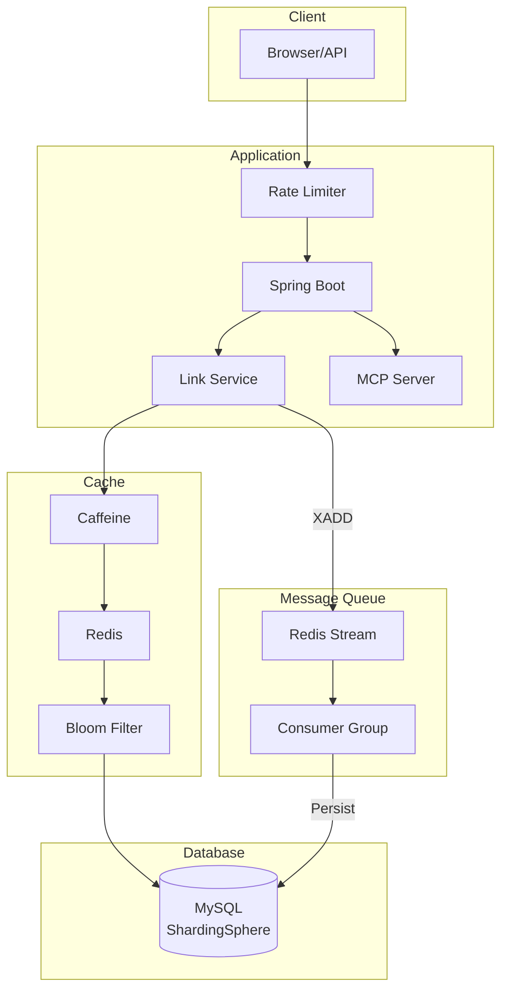
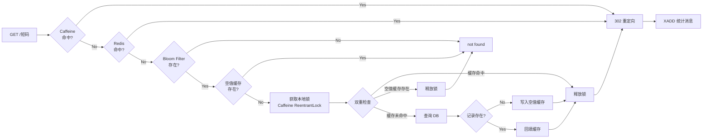
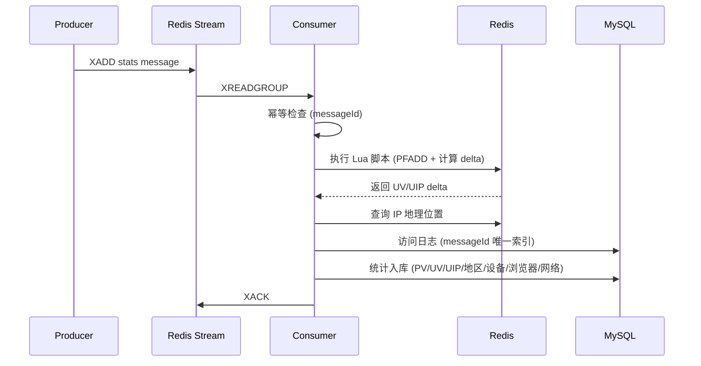
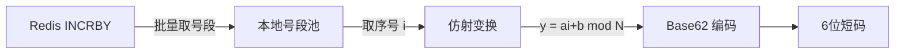

# ShortLink

高性能短链接服务，基于 Spring Boot 3 + Redis + ShardingSphere 构建。

## Features

- **短链接生成** - Redis 号段 + 仿射 Base62，6 位短码
- **302 跳转** - 多级缓存（Caffeine → Redis → Bloom Filter），毫秒级响应
- **访问统计** - Redis Stream 异步消费，多维度统计（PV/UV/地区/设备/浏览器）
- **限流保护** - Guava RateLimiter + Redis Lua 滑动窗口
- **分库分表** - ShardingSphere 16 表水平分片
- **MCP 集成** - 标准 SSE 端点，支持 AI 工具调用

## Tech Stack

| 层级 | 技术 |
|------|------|
| 语言 | Java 17 |
| 框架 | Spring Boot 3.1.10 |
| 构建 | Maven |
| ORM | MyBatis Plus 3.5.5 |
| 数据库 | MySQL 8.0 + ShardingSphere 5.3.2（16 表分片） |
| 缓存 | Caffeine + Redis + Redisson Bloom Filter |
| 消息队列 | Redis Stream + Consumer Group |
| 限流 | Guava RateLimiter + Redis Lua 滑动窗口 |
| IP 定位 | ip2region |
| 部署 | Docker Compose |

## Architecture



## Redirect Flow



## Stats Consumer Flow



## 核心设计

### 短码生成：号段 + 仿射置换



1. **号段模式**：通过 `INCRBY` 一次获取 10000 个序号，减少 Redis 网络往返
2. **异步预取**：号段剩余 20% 时触发异步预取，避免耗尽时阻塞
3. **仿射置换**：`y = (a*i + b) mod 62^6` 打散连续序号，短码不可预测
4. **反向解码**：支持从短码反算序号，快速判断是否可能存在（前置过滤）

### 多级缓存：降低尾延迟

| 层级 | 组件 | 作用 | TTL |
|------|------|------|-----|
| L1 | Caffeine | 热点本地缓存，避免网络开销 | 10min |
| L2 | Redis | 分布式缓存，多实例共享 | 跟随有效期 |
| L3 | Bloom Filter | 快速否定不存在的短码 | 持久化 |
| L4 | 空值缓存 | 防止穿透，缓存不存在的 key | 30min |

**本地互斥锁**：缓存未命中时使用 `Caffeine + ReentrantLock` 做本地锁，避免分布式锁的尾延迟放大问题。

### 异步统计：解耦跳转与持久化

1. **生产**：跳转时 `XADD` 写入统计消息，立即返回 302
2. **消费**：Consumer Group 消费，支持多实例水平扩展
3. **幂等**：messageId 唯一索引 + Redis 标记双重保障
4. **恢复**：定时任务扫描 Pending 消息，自动重试超时未 ACK 的消息
5. **UV/UIP**：HyperLogLog + Lua 脚本原子计算增量
6. **多维统计**：地区、操作系统、浏览器、设备、网络、访问日志

### 分库分表：水平扩展

ShardingSphere 按 `gid` 哈希分 16 张表，避免单表数据量过大：

```
t_link_0, t_link_1, ... t_link_15
t_group_0, t_group_1, ... t_group_15
```

## Quick Start

### 本地开发

```bash
# 1. 确保已安装 JDK 17、Maven、MySQL 8.0、Redis 7.0
# 2. 在 MySQL 中创建数据库并导入表结构
mysql -u root -p -e "CREATE DATABASE IF NOT EXISTS db_shortlink"
mysql -u root -p db_shortlink < link.sql

# 3. 修改 src/main/resources/application.yaml 中的数据库和 Redis 连接信息
# 4. 构建并运行
mvn clean package -DskipTests
java -jar target/shortlink-all-1.0-SNAPSHOT.jar
```

服务启动后访问：
- API 文档：`http://127.0.0.1:8068/scalar.html`
- Swagger UI：`http://127.0.0.1:8068/swagger-ui.html`

### Docker 部署

参考 [DEPLOYMENT.md](DEPLOYMENT.md)

## API 概览

| 方法 | 路径 | 说明 |
|------|------|------|
| `GET` | `/{shortUri}` | 302 重定向 |
| `POST` | `/api/short-link/v1/create` | 创建短链接 |
| `POST` | `/api/short-link/v1/create/batch` | 批量创建 |
| `POST` | `/api/short-link/v1/update` | 更新短链接 |
| `GET` | `/api/short-link/v1/page` | 分页查询 |
| `GET` | `/api/short-link/v1/stats` | 访问统计 |
| `GET` | `/scalar.html` | API 文档（Scalar） |

完整接口文档在 Swagger / Scalar 页面查看。

## Project Structure

```
src/main/java/dev/haotangyuan/shortlink/
├── common/           # 配置、过滤器、异常处理
├── controller/       # 接口（core + admin）
├── service/          # 业务逻辑
├── dao/              # 数据访问层
├── mq/               # Redis Stream 生产者/消费者
├── mcp/              # MCP AI 工具集成
└── toolkit/          # 工具类（短码生成、IP 地理位置）
```
