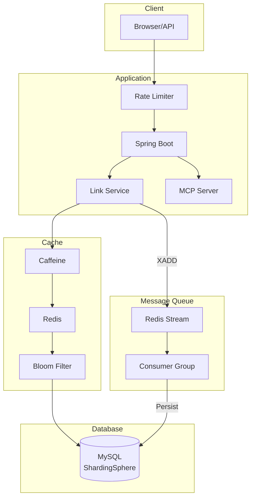
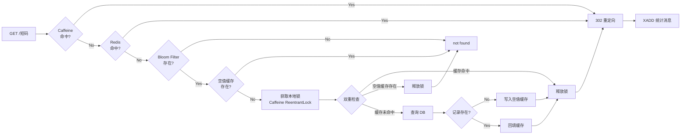
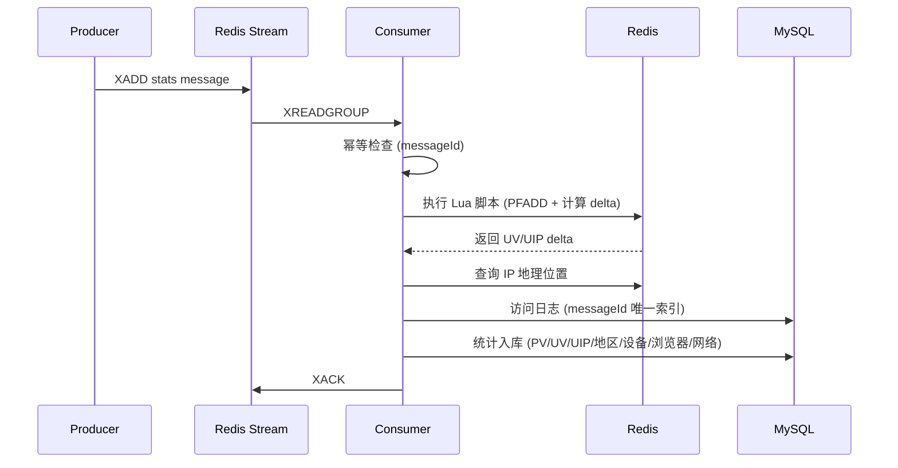
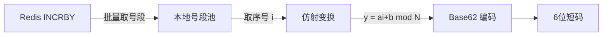

# ShortLink

高性能短链接服务，基于 Spring Boot 3 + Redis + ShardingSphere 构建。

## Features

- **短链接生成** - Redis 号段 + 仿射 Base62，6 位短码
- **302 跳转** - 多级缓存（Caffeine → Redis → Bloom Filter），毫秒级响应
- **访问统计** - Redis Stream 异步消费，多维度统计（PV/UV/地区/设备/浏览器）
- **限流保护** - Guava RateLimiter + Redis Lua 滑动窗口
- **分库分表** - ShardingSphere 16 表水平分片
- **MCP 集成** - 标准 SSE 端点，支持 AI 工具调用

## Tech Stack

| 层级 | 技术 |
|------|------|
| 语言 | Java 21 |
| 框架 | Spring Boot 3.1.10 |
| 构建 | Maven |
| ORM | MyBatis Plus 3.5.5 |
| 数据库 | MySQL 8.0 + ShardingSphere 5.3.2（16 表分片） |
| 缓存 | Caffeine + Redis + Redisson Bloom Filter |
| 消息队列 | Redis Stream + Consumer Group |
| 限流 | Guava RateLimiter + Redis Lua 滑动窗口 |
| IP 定位 | ip2region |

## 本地启动

### 1. 环境准备

```bash
# JDK 21
java -version  # 应输出 21.x

# Maven 3.6+
mvn -version

# MySQL 8.0（需运行中）
mysql --version

# Redis 7.0（需运行中）
redis-cli ping  # 应返回 PONG
```

### 2. 初始化数据库

登录 MySQL，创建数据库和用户，导入表结构：

```sql
CREATE DATABASE IF NOT EXISTS db_shortlink DEFAULT CHARACTER SET utf8mb4;

-- 创建应用专用用户（与 shardingsphere-config.yaml 中的配置一致）
CREATE USER IF NOT EXISTS 'linkapp'@'127.0.0.1' IDENTIFIED BY 'YourStrongPassword';
GRANT ALL PRIVILEGES ON db_shortlink.* TO 'linkapp'@'127.0.0.1';
FLUSH PRIVILEGES;
```

导入表结构：

```bash
mysql -u root -p db_shortlink < link.sql
```

> **注意**：如果你使用不同的 MySQL 用户名或密码，请修改 `src/main/resources/shardingsphere-config.yaml` 第 7-8 行的 `username` 和 `password`。

### 3. 启动 Redis

```bash
# macOS (Homebrew)
brew services start redis

# Linux
sudo systemctl start redis
```

项目默认连接本地无密码的 Redis。如果需要密码，在 `src/main/resources/application.yaml` 的 `spring.data.redis` 下添加 `password` 配置。

### 4. 构建并启动

```bash
# 编译打包
mvn clean package -DskipTests

# 启动（JDK 21）
export JAVA_HOME=/path/to/jdk-21
java -jar target/shortlink-all-1.0-SNAPSHOT.jar
```

启动成功后会看到：

```
Started ShortLinkApplication in X seconds
Tomcat started on port(s): 8068 (http)
```

### 5. 访问验证

打开浏览器访问：

- **API 文档（Scalar）**：http://127.0.0.1:8068/scalar.html
- **Swagger UI**：http://127.0.0.1:8068/swagger-ui/index.html

### 6. 快速接口测试

```bash
# 1. 注册用户
curl -s http://localhost:8068/api/short-link/admin/v1/user \
  -X POST -H "Content-Type: application/json" \
  -d '{"username":"admin","password":"123456","realName":"Admin","phone":"13800000000","mail":"admin@test.com"}'

# 2. 登录获取 Token
curl -s http://localhost:8068/api/short-link/admin/v1/user/login \
  -X POST -H "Content-Type: application/json" \
  -d '{"username":"admin","password":"123456"}'
# 返回 {"data":{"token":"xxx-xxx-xxx"}}

# 3. 查看分组（注册后自动创建"默认分组"）
TOKEN="<上一步的token>"
curl -s http://localhost:8068/api/short-link/admin/v1/group \
  -H "Authorization: Bearer $TOKEN"

# 4. 创建短链接（GID 为上一步返回的 gid）
curl -s http://localhost:8068/api/short-link/admin/v1/create \
  -X POST -H "Content-Type: application/json" \
  -H "Authorization: Bearer $TOKEN" \
  -d '{"domain":"127.0.0.1:8068","originUrl":"https://github.com","gid":"<你的gid>","describe":"测试","validDateType":0}'
# 返回 {"data":{"fullShortUrl":"http://127.0.0.1:8068/xxxxxx"}}

# 5. 验证跳转
curl -v http://127.0.0.1:8068/xxxxxx
# 应返回 302 重定向到 https://github.com
```

> **认证说明**：admin 接口（`/api/short-link/admin/v1/*`）使用登录后返回的 Session Token，放在 `Authorization: Bearer <token>` 头中。core 接口（`/api/short-link/v1/*`）使用 API Token（在后台管理页面创建）。

## Architecture



## Redirect Flow



## Stats Consumer Flow



## 核心设计

### 短码生成：号段 + 仿射置换



1. **号段模式**：通过 `INCRBY` 一次获取 10000 个序号，减少 Redis 网络往返
2. **异步预取**：号段剩余 20% 时触发异步预取，避免耗尽时阻塞
3. **仿射置换**：`y = (a*i + b) mod 62^6` 打散连续序号，短码不可预测
4. **反向解码**：支持从短码反算序号，快速判断是否可能存在（前置过滤）

### 多级缓存：降低尾延迟

| 层级 | 组件 | 作用 | TTL |
|------|------|------|-----|
| L1 | Caffeine | 热点本地缓存，避免网络开销 | 10min |
| L2 | Redis | 分布式缓存，多实例共享 | 跟随有效期 |
| L3 | Bloom Filter | 快速否定不存在的短码 | 持久化 |
| L4 | 空值缓存 | 防止穿透，缓存不存在的 key | 30min |

**本地互斥锁**：缓存未命中时使用 `Caffeine + ReentrantLock` 做本地锁，避免分布式锁的尾延迟放大问题。

### 异步统计：解耦跳转与持久化

1. **生产**：跳转时 `XADD` 写入统计消息，立即返回 302
2. **消费**：Consumer Group 消费，支持多实例水平扩展
3. **幂等**：messageId 唯一索引 + Redis 标记双重保障
4. **恢复**：定时任务扫描 Pending 消息，自动重试超时未 ACK 的消息
5. **UV/UIP**：HyperLogLog + Lua 脚本原子计算增量
6. **多维统计**：地区、操作系统、浏览器、设备、网络、访问日志

### 分库分表：水平扩展

ShardingSphere 按 `gid` 哈希分 16 张表，避免单表数据量过大：

```
t_link_0, t_link_1, ... t_link_15
t_group_0, t_group_1, ... t_group_15
```

## API 概览

完整接口文档请在启动后访问 Scalar 页面查看。核心接口：

| 方法 | 路径 | 说明 |
|------|------|------|
| `GET` | `/{shortUri}` | 302 重定向 |
| `POST` | `/api/short-link/v1/create` | 创建短链接 |
| `POST` | `/api/short-link/v1/create/batch` | 批量创建 |
| `POST` | `/api/short-link/v1/update` | 更新短链接 |
| `GET` | `/api/short-link/v1/page` | 分页查询 |
| `GET` | `/api/short-link/v1/stats` | 访问统计 |
| `GET` | `/api/short-link/v1/count` | 分组短链接数量 |
| `POST` | `/api/short-link/admin/v1/user` | 用户注册 |
| `POST` | `/api/short-link/admin/v1/user/login` | 用户登录 |
| `GET` | `/api/short-link/admin/v1/group` | 分组列表 |
| `POST` | `/api/short-link/admin/v1/group` | 创建分组 |
| `GET` | `/scalar.html` | API 文档（Scalar） |
| `GET` | `/swagger-ui/index.html` | Swagger UI |

## Project Structure

```
src/main/java/dev/haotangyuan/shortlink/
├── common/           # 配置、过滤器、异常处理
│   ├── config/       # Spring 配置类
│   ├── web/          # 全局异常处理、过滤器
│   └── convention/   # 统一返回码、异常定义
├── controller/       # 接口层（admin + core）
├── service/          # 业务逻辑层
├── dao/              # 数据访问层（entity + mapper）
├── dto/              # 请求参数对象
│   ├── req/          # 请求 DTO
│   └── biz/          # 内部业务 DTO
├── vo/               # 响应视图对象
├── mq/               # Redis Stream 生产者/消费者
│   ├── producer/     # 消息生产者
│   ├── consumer/     # 消息消费者
│   └── task/         # 定时任务（Pending 消息恢复）
├── mcp/              # MCP AI 工具集成
└── toolkit/          # 工具类（短码生成、IP 地理位置）
```
