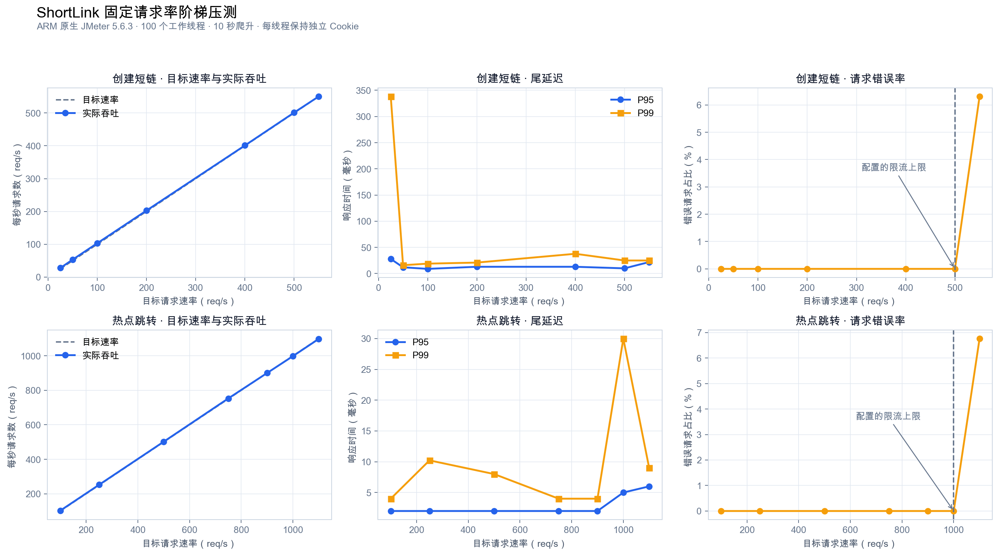
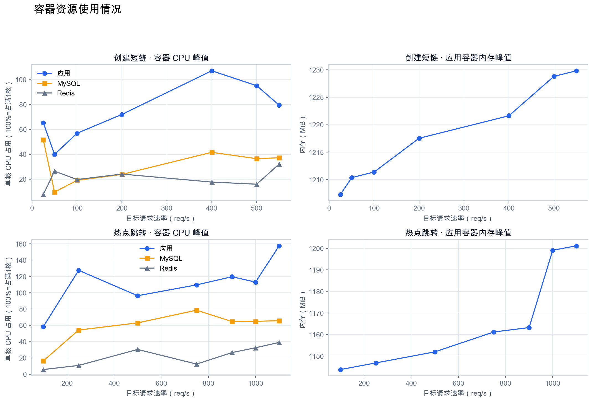

# ShortLink

高性能短链接服务，基于 Spring Boot 3 + Redis + ShardingSphere 构建。

## Features

- **短链接生成** - Redis 号段 + 仿射 Base62，6 位短码
- **302 跳转** - 多级缓存（Caffeine → Redis → Bloom Filter），毫秒级响应
- **访问统计** - Redis Stream 异步消费，多维度统计（PV/UV/地区/设备/浏览器）
- **限流保护** - Guava RateLimiter + Redis Lua 滑动窗口
- **分库分表** - ShardingSphere 16 表水平分片
- **MCP 集成** - 标准 SSE 端点，支持 AI 工具调用
- **AI 运营助手** - ReAct Agent 智能分析，SSE 流式对话，多轮上下文，6 个分析工具（流量统计/链接对比/异常检测/健康检查）

## 简历描述

LinkPilot 是一个基于 Spring Boot 3、Redis、MySQL、ShardingSphere、Caffeine 和 React 构建的智能短链管理平台，支持短链创建、跳转、统计分析和运营管理。

- **分布式短码生成：** 使用 Redis `INCRBY` 按 1 万个序号批量分配号段，以本地原子递增和 20% 阈值异步预取降低远程取号频率；通过仿射置换与定长 Base62 编码生成不可顺序猜测且无算法碰撞的 6/7 位短码。
- **高并发跳转与缓存一致性：** 构建 Caffeine、Redis、Bloom Filter、空值缓存和数据库的分层查询链路，使用按短链隔离的本地锁与双重检查抑制缓存击穿；创建事务提交后再预热缓存，更新、回收和分组迁移同步失效缓存，避免脏读与悬空路由。
- **可靠异步统计：** 通过 Redis Stream 消费者组异步落库 PV、UV、UIP 及地域、设备等多维指标，以 Redis 幂等状态、数据库消息唯一键、业务成功后手动 ACK 和 `XAUTOCLAIM` 补偿保证可重试消费；使用带消息级增量缓存的 HyperLogLog Lua 脚本避免事务回滚后 UV/UIP 丢计。
- **分片与安全治理：** 使用 ShardingSphere 按 `gid` 将短链水平拆分为 16 张表，并在事务与读写锁内原子迁移分组路由；补齐 Session/API Token 双通道鉴权、资源归属校验、服务端请求 SSRF 防护、Guava 令牌桶及 Redis Lua 用户级滑动窗口限流。
- **AI 与全栈运营：** 基于 AgentScope ReAct Agent 构建按请求隔离的流式会话，通过 `RuntimeContext` 将用户身份安全注入 6 个统计分析工具，并提供标准 MCP 端点；React 控制台支持会话管理、流式中止、精确分组看板和短链全生命周期管理。

> 维护规则：仅描述仓库中已落地且可验证的能力；引入、删除或实质改变上述能力时，同步更新本节。性能数据必须注明压测条件和结果来源。

## Tech Stack

| 层级 | 技术 |
|------|------|
| 语言 | Java 21 |
| 框架 | Spring Boot 3.1.10 |
| 构建 | Maven |
| ORM | MyBatis Plus 3.5.5 |
| 数据库 | MySQL 8.0 + ShardingSphere 5.3.2（16 表分片） |
| 缓存 | Caffeine + Redis + Redisson Bloom Filter |
| 消息队列 | Redis Stream + Consumer Group |
| 限流 | Guava RateLimiter + Redis Lua 滑动窗口 |
| AI | AgentScope Java 2.0（ReAct Agent + SSE 流式） |
| IP 定位 | ip2region |
| 前端 | React 19 + TypeScript + Vite 8 + Tailwind CSS 4 |

## 本地启动

### 1. 环境准备

```bash
java -version  # JDK 21
mvn -version   # Maven 3.6+
mysql --version # MySQL 8.0
redis-cli ping  # Redis 7.0 → PONG
```

### 2. 初始化数据库

```sql
CREATE DATABASE IF NOT EXISTS db_shortlink DEFAULT CHARACTER SET utf8mb4;
CREATE USER IF NOT EXISTS 'linkapp'@'127.0.0.1' IDENTIFIED BY 'YourStrongPassword';
GRANT ALL PRIVILEGES ON db_shortlink.* TO 'linkapp'@'127.0.0.1';
FLUSH PRIVILEGES;
```

```bash
mysql -u root -p db_shortlink < link.sql
```

### 3. 构建并启动

```bash
mvn clean package -DskipTests
java -jar target/shortlink-all-1.0-SNAPSHOT.jar
```

本地开发需要加载 `application-local.yaml`（本地数据库与 AI 配置）时：

```bash
mvn spring-boot:run -Dspring-boot.run.profiles=local
# 或：java -jar target/shortlink-all-1.0-SNAPSHOT.jar --spring.profiles.active=local
```

或 Docker：

```bash
docker-compose up -d
```

### 4. 前端开发

```bash
cd frontend && npm install && npm run dev
```

### 5. 访问

- **前端应用**：http://127.0.0.1:8068/app
- **API 文档（Scalar）**：http://127.0.0.1:8068/scalar.html
- **Swagger UI**：http://127.0.0.1:8068/swagger-ui/index.html
- **MCP 端点**：http://127.0.0.1:8068/api/mcp

## 核心设计

### 短码生成：号段 + 仿射置换

```
Redis INCRBY → 批量取号段 → 仿射变换 y=(ai+b)mod62^6 → Base62 → 6位短码
```

- 号段模式批量取号，减少 Redis 网络往返
- 异步预取：号段剩余 20% 时触发
- 仿射置换打散连续序号，短码不可预测

### 多级缓存

| 层级 | 组件 | TTL |
|------|------|-----|
| L1 | Caffeine | 10min |
| L2 | Redis | 跟随有效期 |
| L3 | Bloom Filter | 持久化 |
| L4 | 空值缓存 | 30min |

### 异步统计

跳转 → XADD Redis Stream → Consumer Group → Lua(PFADD) → 异步入库

> 详细架构说明见 [notebook/intro/核心架构.md](notebook/intro/核心架构.md)

## 性能压测

仓库提供参数化 JMeter 5.6.3 计划，分别测试短链创建与热点短链跳转。压测结果只在相同代码版本、机器配置、JVM 参数和数据状态下可比较；不要把并发线程数写成 QPS。

### 执行方法

先启动完整服务并创建一条长期有效的短链，再从项目根目录执行：

```bash
# 热点跳转：100 个工作线程，以固定 900 req/s 持续 40 秒
SHORT_URI=abc123 THREADS=100 TARGET_RPS=900 DURATION_SECONDS=40 ./scripts/run-benchmark.sh redirect

# 创建短链：固定 400 req/s；登录压测时可额外传入 AUTH_HEADER 和 GID
THREADS=100 TARGET_RPS=400 DURATION_SECONDS=40 ./scripts/run-benchmark.sh create
```

脚本优先使用本机 JMeter，没有安装时使用 Docker 镜像。每次结果保存到 `benchmark/results/<时间>-<场景>/`：`samples.jtl` 是原始样本，`dashboard/index.html` 是 JMeter HTML 报告。原始样本和 HTML 报告默认不提交 Git；发布 README 数据时应将它们归档到 Release/CI Artifact，并至少记录以下信息：

| 项目 | 必填内容 |
| --- | --- |
| 代码版本 | Git commit SHA；工作区有改动时标记 `dirty` |
| 环境 | CPU、内存、操作系统、JDK/JVM 参数、JMeter 版本 |
| 拓扑 | 压测机与服务是否同机，应用/MySQL/Redis 实例数 |
| 场景 | 接口、并发线程、爬升时间、稳定运行时间、数据预热方式 |
| 结果 | 吞吐量、平均延迟、P90/P95/P99、错误率、CPU/内存峰值 |

### 指标说明

| 指标 | 含义 | 阅读方法 |
| --- | --- | --- |
| 目标速率 | JMeter 计划每秒向服务发送的请求数 | 用于控制每档压力，例如目标 `500 req/s`，不是并发线程数。 |
| 实际吞吐 | 服务端实际完成的请求数，单位为 `req/s` | 越接近目标速率越好；明显低于目标通常说明服务或压测端已经排队。 |
| 平均延迟 | 全部请求响应时间的平均值 | 容易被少数极慢请求影响，只能作为整体参考。 |
| P95 | 95% 的请求响应时间不超过该值 | 比平均值更能反映大多数用户的真实体验。 |
| P99 | 99% 的请求响应时间不超过该值 | 用于观察最慢的 1% 请求和系统尾部抖动。 |
| 错误率 | HTTP 状态码或响应断言失败的请求占比 | 本测试超过限流上限后的错误主要是预期的 HTTP 429。 |
| CPU 峰值 | 采样期间容器使用 CPU 的最高值 | `100%` 表示占满一个 CPU 核，超过 `100%` 表示同时使用了多个核。 |
| 内存峰值 | 应用容器采样到的最高内存占用 | 用来检查随压力上升是否出现持续膨胀；本图单位为 MiB。 |

并发线程数表示“同时可以发请求的虚拟用户数”，请求速率表示“每秒实际发送多少请求”。线程会在收到响应后继续发送下一次请求，因此 10 个无限循环线程也可能产生每秒数千次请求；本项目使用固定目标速率避免把线程数误当成系统吞吐量。

### 已发布结果

测试时间：2026-07-11。测试对象为当前工作区构建的单应用实例，基线提交为 `1dde4f1`，包含统计查询模块重构；压测工具与 README 更新尚未提交，因此工作区为 `dirty`。使用 ARM 原生 JMeter、100 个工作线程和固定请求率阶梯加压；每个线程保留自己的 UV Cookie。应用/MySQL/Redis 运行在 Docker，压测端运行在 macOS 宿主机。

| 场景 | 目标速率 | 实际吞吐 | 平均延迟 | P95 | P99 | 错误率 |
| --- | ---: | ---: | ---: | ---: | ---: | ---: |
| 创建短链（稳定档） | 500 req/s | 501.3 req/s | 4.70 ms | 10 ms | 25 ms | 0% |
| 创建短链（超过限流） | 550 req/s | 550.4 req/s | 12.01 ms | 22 ms | 25 ms | 6.31% |
| 热点跳转（稳定档） | 1,000 req/s | 998.1 req/s | 1.88 ms | 5 ms | 30 ms | 0% |
| 热点跳转（超过限流） | 1,100 req/s | 1,098.0 req/s | 3.19 ms | 6 ms | 9 ms | 6.76% |





测试环境：Apple M3 Pro（12 核）、18 GB 内存、macOS 26.5.1、Docker Desktop 29.5.2；应用容器使用 Java 21、`-Xms512m -Xmx1024m`，MySQL 8.0、Redis 7.0；压测端为宿主机 ARM 原生 JMeter 5.6.3。完整阶梯数据见 [summary.json](benchmark/results/2026-07-11-native-rate/summary.json)。

> 结果解读：在当前单机环境和配置的限流边界内，创建链路稳定达到 500 req/s，热点跳转稳定达到 1,000 req/s，且错误率为 0；超过配置上限后约 6% 请求被限流拒绝，符合预期。该结果用于同环境版本对比，不代表独立压测机或生产集群的容量上限。

## 技术亮点

- 短码生成：号段 + 仿射置换 + Base62
- 多级缓存：Caffeine → Redis → Bloom Filter → 空值缓存
- 异步统计：Redis Stream + Consumer Group + 幂等消费
- 分库分表：ShardingSphere 16 表水平分片
- 限流流控：Guava RateLimiter + Redis Lua 滑动窗口
- MCP 集成：标准 SSE 端点，AI Agent 可调用
- AI 运营助手：AgentScope ReAct Agent + SSE 流式 + 多轮上下文 + 异常检测

> 完整技术亮点见 [notebook/intro/技术亮点.md](notebook/intro/技术亮点.md)

## API 接口

> 完整接口文档见 [notebook/intro/API接口文档.md](notebook/intro/API接口文档.md) 或启动后访问 Scalar UI

| 方法 | 路径 | 说明 |
|------|------|------|
| GET | `/{shortUri}` | 302 重定向 |
| POST | `/api/short-link/v1/create` | 创建短链接 |
| POST | `/api/short-link/v1/create/batch` | 批量创建 |
| POST | `/api/short-link/v1/update` | 更新短链接 |
| GET | `/api/short-link/v1/page` | 分页查询 |
| GET | `/api/short-link/v1/stats` | 访问统计 |
| POST | `/api/short-link/admin/v1/user` | 用户注册 |
| POST | `/api/short-link/admin/v1/user/login` | 用户登录 |
| GET | `/api/short-link/admin/v1/group` | 分组列表 |
| POST | `/api/short-link/admin/v1/ai/chat/stream` | AI 对话（SSE 流式） |
| GET | `/api/short-link/admin/v1/ai/sessions` | AI 会话列表 |

## 文档目录

| 文档 | 说明 |
|------|------|
| [核心架构](notebook/intro/核心架构.md) | 分层架构、核心流程、关键类职责 |
| [技术亮点](notebook/intro/技术亮点.md) | 短码生成、多级缓存、异步统计等 |
| [API 接口文档](notebook/intro/API接口文档.md) | REST API 详细说明 |
| [开发者准则](notebook/rules/开发者准则.md) | 分支管理、文档同步、提交规范等 |
| [未来计划](notebook/plan/未来计划.md) | 高级功能、高可用、开放平台等 |
| [开发记录](notebook/dev/) | 每次开发的变更记录 |

## Project Structure

```
src/main/java/dev/haotangyuan/shortlink/
├── common/           # 配置、过滤器、异常处理
├── controller/       # 接口层（admin + core）
├── service/          # 业务逻辑层
├── dao/              # 数据访问层（entity + mapper）
├── dto/              # 请求参数对象
├── vo/               # 响应视图对象
├── mq/               # Redis Stream 生产者/消费者
├── mcp/              # MCP AI 工具集成
├── ai/               # AI 运营助手（ReAct Agent + 分析工具）
└── toolkit/          # 工具类（短码生成、IP 地理位置）
```
