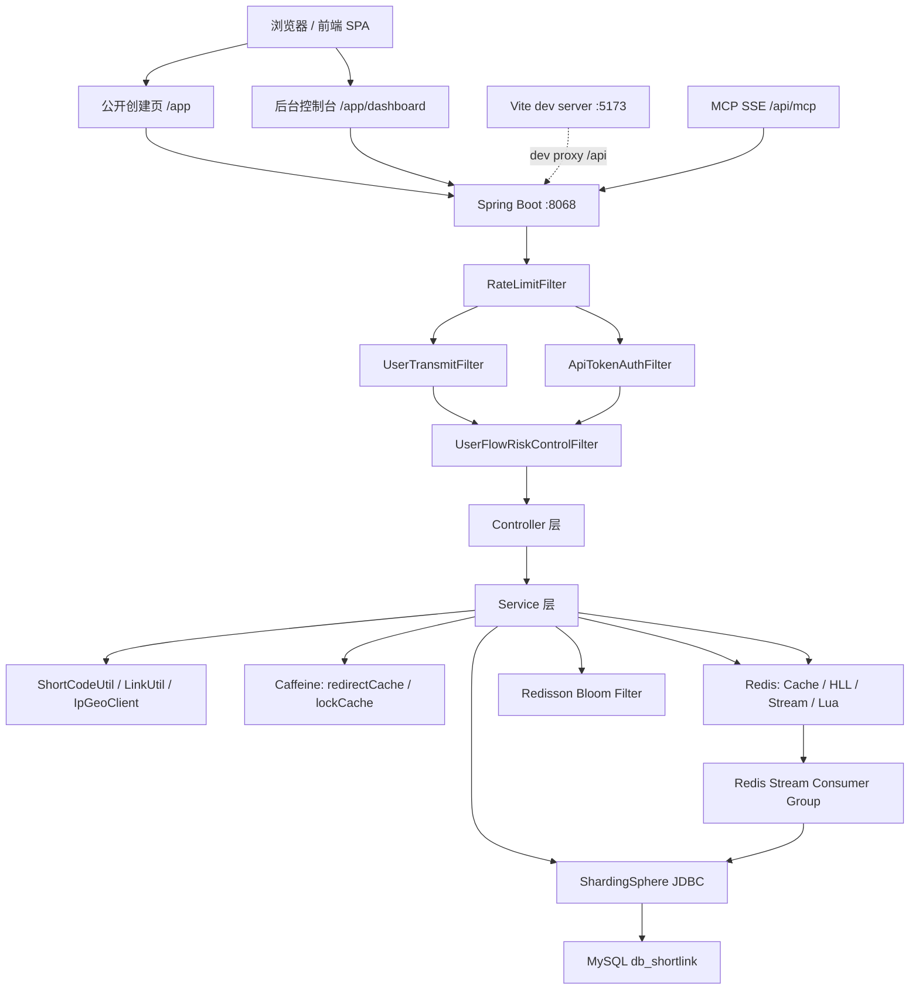
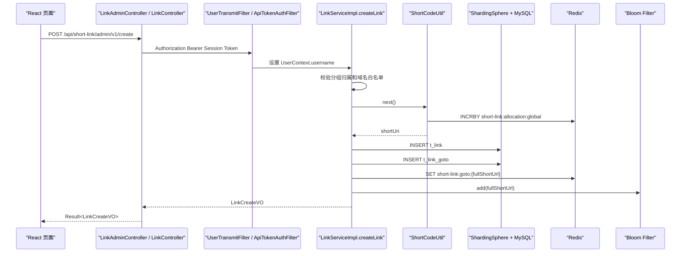
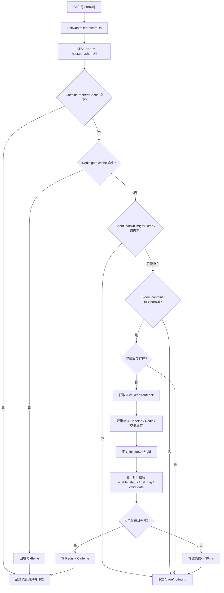
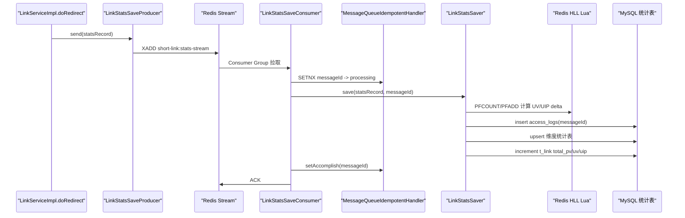
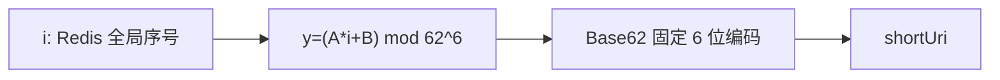
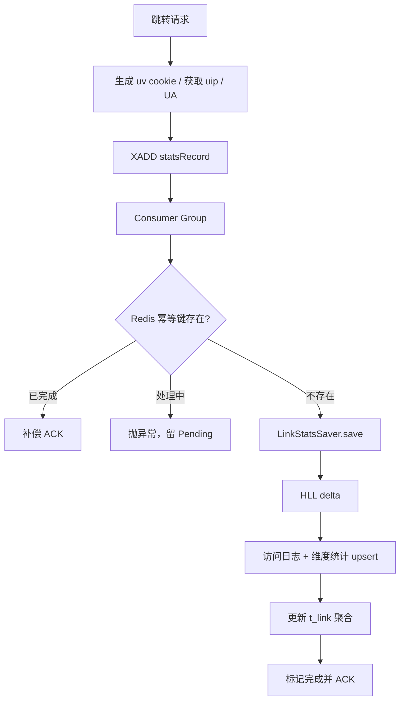
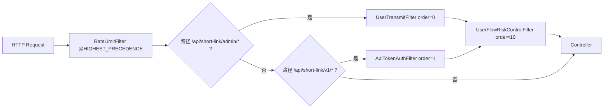
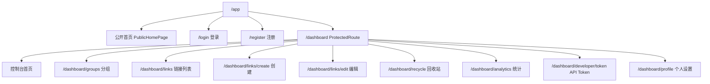

# ShortLink 项目技术文档

> 面向新成员的工程级技术导览。本文基于当前源码、`link.sql`、Spring 配置、Docker 配置和前端源码整理；如与早期 README 或旧 intro 文档存在差异，以本文标注的源码事实为准。

## 目录

- [1. 项目概览](#1-项目概览)
- [2. 快速开始](#2-快速开始)
- [3. 代码结构](#3-代码结构)
- [4. 整体架构设计](#4-整体架构设计)
- [5. 数据库设计](#5-数据库设计)
- [6. 从请求到响应的完整链路](#6-从请求到响应的完整链路)
- [7. 短码生成算法](#7-短码生成算法)
- [8. 缓存、防穿透与一致性](#8-缓存防穿透与一致性)
- [9. 异步统计与可靠性](#9-异步统计与可靠性)
- [10. 认证、授权与限流](#10-认证授权与限流)
- [11. 前端架构与请求链路](#11-前端架构与请求链路)
- [12. MCP 与工具系统](#12-mcp-与工具系统)
- [13. 可观测性与排障](#13-可观测性与排障)
- [14. 配置说明](#14-配置说明)
- [15. 关键类与调用链速查](#15-关键类与调用链速查)
- [16. 开发扩展指南](#16-开发扩展指南)
- [17. 常见问题](#17-常见问题)

---

## 1. 项目概览

### 1.1 概述

ShortLink 是一个高性能短链接服务，核心能力包括短链接创建、302 跳转、分组管理、回收站、访问统计、API Token、MCP 工具调用和 AI 运营助手。后端采用 Spring Boot 3 单体架构，数据层通过 ShardingSphere 做水平分片，缓存与消息系统主要依赖 Redis、Redisson、Caffeine 和 Redis Stream；前端是 React 19 + Vite 的 SPA，生产路径挂载在 `/app`。

项目与 AI/Agent 相关的部分有两层：MCP Server 通过 `/api/mcp` 暴露标准 SSE 传输，注册 `createShortLink` 工具供外部 Agent 调用；AI 运营助手（AI Copilot）基于 AgentScope Java 2.0 的 `ReActAgent` 构建，内置 6 个分析工具，通过 SSE 流式对话为运营人员提供智能数据分析。

### 1.2 详细说明

| 维度 | 当前实现 |
|------|----------|
| 后端语言 | Java 21 |
| 后端框架 | Spring Boot 3.1.10 |
| ORM | MyBatis Plus 3.5.5 |
| 数据库 | MySQL 8.0 + ShardingSphere JDBC 5.3.2 |
| 缓存 | Caffeine、Redis、Redisson Bloom Filter |
| 消息队列 | Redis Stream + Consumer Group |
| 限流 | Guava `RateLimiter` + Redis Lua 滑动窗口 |
| 统计 | Redis HLL 计算 UV/UIP 增量，MySQL 维度表聚合 |
| 前端 | React 19、TypeScript、React Router、React Query、Tailwind CSS、Recharts |
| AI 集成 | MCP Java SDK（SSE endpoint `/api/mcp`）+ AgentScope ReAct Agent（AI Copilot） |

### 1.3 示例

```text
用户创建短链 -> Redis 号段生成短码 -> 写 t_link / t_link_goto -> 预热 Redis / Bloom
用户访问短链 -> Caffeine / Redis / Bloom / DB 回源 -> 302 -> XADD 统计消息
统计消费者 -> HLL 计算 UV/UIP 增量 -> upsert 多维统计表 -> ACK
```

---

## 2. 快速开始

### 2.1 概述

本地开发至少需要 Java 21、Maven、MySQL 8.0 和 Redis 7.0。后端默认端口是 `8068`，前端开发端口是 `5173`，生产 SPA 入口是 `http://127.0.0.1:8068/app`。

### 2.2 详细说明

#### 2.2.1 环境准备

```bash
java -version
mvn -version
mysql --version
redis-cli ping
```

#### 2.2.2 初始化数据库

```sql
CREATE DATABASE IF NOT EXISTS db_shortlink DEFAULT CHARACTER SET utf8mb4;
CREATE USER IF NOT EXISTS 'linkapp'@'127.0.0.1' IDENTIFIED BY 'YourStrongPassword';
GRANT ALL PRIVILEGES ON db_shortlink.* TO 'linkapp'@'127.0.0.1';
FLUSH PRIVILEGES;
```

```bash
mysql -u root -p db_shortlink < link.sql
```

本地 ShardingSphere 配置位于 `src/main/resources/shardingsphere-config.yaml`，默认连接：

```yaml
dataSources:
  ds_0:
    jdbcUrl: jdbc:mysql://127.0.0.1:3306/db_shortlink
    username: linkapp
    password: YourStrongPassword
```

#### 2.2.3 构建与启动后端

```bash
mvn clean package -DskipTests
java -jar target/shortlink-all-1.0-SNAPSHOT.jar
```

#### 2.2.4 启动前端开发服务器

```bash
cd frontend
npm install
npm run dev
```

开发模式下 Vite 将 `/api` 代理到 `http://127.0.0.1:8068`，前端访问 `http://127.0.0.1:5173/app`。

#### 2.2.5 Docker Compose 启动

```bash
docker-compose up -d
```

Compose 会启动：

| 服务 | 镜像 | 端口 | 说明 |
|------|------|------|------|
| `mysql` | `mysql:8.0` | `3306` | 挂载 `link.sql` 自动初始化 |
| `redis` | `redis:7.0-alpine` | `6379` | 默认开启密码 |
| `app` | `ghcr.io/haotangyuan/shortlink:latest` | `8068` | 挂载 Docker 专用配置 |

注意：`shardingsphere-config-docker.yaml` 明确写了数据库密码。ShardingSphere YAML 不解析 `.env` 占位符，修改 MySQL 密码时需要同步改这个文件。

### 2.3 示例

启动后可访问：

| 入口 | URL |
|------|-----|
| 前端应用 | `http://127.0.0.1:8068/app` |
| Scalar API 文档 | `http://127.0.0.1:8068/scalar.html` |
| Swagger UI | `http://127.0.0.1:8068/swagger-ui/index.html` |
| MCP SSE | `http://127.0.0.1:8068/api/mcp` |

---

## 3. 代码结构

### 3.1 概述

项目以一个 Spring Boot 应用承载管理端 API、核心 API、短链跳转、MCP SSE 和静态前端资源。前端源码独立放在 `frontend/`，构建产物可复制到 `src/main/resources/static/app` 后由后端托管。

### 3.2 详细说明

```text
src/main/java/dev/haotangyuan/shortlink
├── common/              # 通用配置、异常、结果、过滤器、用户上下文
├── controller/
│   ├── admin/           # 管理端接口，使用 Session Token
│   └── core/            # Core API 与短链跳转，Core API 使用 API Token
├── dao/
│   ├── entity/          # MyBatis Plus 实体
│   └── mapper/          # Mapper 注解 SQL 与 BaseMapper
├── dto/                 # 请求 DTO 和内部业务 DTO
├── initialize/          # Redis Stream Consumer Group 初始化
├── mcp/                 # MCP Server 和工具注册
├── ai/                  # AI 运营助手（AgentScope ReAct Agent + 分析工具）
├── mq/                  # Redis Stream 生产、消费、幂等、巡检、清理
├── service/             # 业务接口与实现
├── toolkit/             # 短码、链接工具、IP 地理位置
└── vo/                  # 响应视图对象

frontend/src
├── api/                 # fetch 封装、admin/core API、类型定义
├── app/                 # Provider 和 Router
├── components/          # 布局和通用 UI
├── features/            # 业务页面：登录、链接、分组、统计、Token 等
├── frontend/src/lib/    # 日期、className 工具
└── store/               # Auth Context
```

### 3.3 示例

前端构建并嵌入后端静态资源：

```bash
scripts/build-frontend.sh
```

脚本会执行 `npm run build`，再将 `frontend/dist` 复制到 `src/main/resources/static/app`。

---

## 4. 整体架构设计

### 4.1 概述

系统采用“同步核心链路 + 异步统计链路”的设计：创建与跳转需要低延迟和强可用，统计写入允许异步最终一致。短链跳转链路尽量避免分布式锁，使用本地 Caffeine 锁和缓存降低 Redis、DB 压力；统计链路用 Redis Stream 保证可恢复消费。

### 4.2 详细说明



#### 4.2.1 设计决策与权衡

| 设计点 | 当前方案 | 优点 | 代价 |
|--------|----------|------|------|
| 短码生成 | Redis 号段 + 仿射置换 + Base62 | 减少 Redis 往返，短码不可预测 | 需要维护 Redis 全局分配 Key |
| 跳转缓存 | Caffeine -> Redis -> Bloom -> DB | 热点跳转延迟低，防止穿透 | 本地缓存多实例下存在短时间不一致 |
| 回源互斥 | Caffeine 管理 `ReentrantLock` | 避免跳转热点使用分布式锁放大尾延迟 | 只对单实例生效，多实例靠 Redis/DB 承压 |
| 统计写入 | Redis Stream 异步消费 | 跳转链路不等待 DB 统计写入 | 统计数据最终一致 |
| UV/UIP | Redis HyperLogLog | 内存小，天然适合近似去重 | HLL 是近似值，不能作为强精确计数 |
| 分片 | ShardingSphere 16 表 | 降低单表压力 | 查询必须带分片键，否则可能广播 |
| AI 集成 | MCP SSE 注册工具 | Agent 可直接调用创建短链能力 | 目前只注册了一个工具 |

### 4.3 示例

典型运行路径：

```text
POST /api/short-link/admin/v1/create
  -> RateLimitFilter
  -> UserTransmitFilter
  -> UserFlowRiskControlFilter
  -> LinkAdminController.createLink
  -> LinkServiceImpl.createLink
  -> ShortCodeUtil.next
  -> t_link / t_link_goto
  -> Redis goto cache + Bloom
```

---

## 5. 数据库设计

### 5.1 概述

数据库脚本位于 `link.sql`。核心分片表包括 `t_link_${0..15}`、`t_link_goto_${0..15}` 和 `t_group_${0..15}`；用户、Token 和统计表当前是单表。ShardingSphere 配置位于 `src/main/resources/shardingsphere-config.yaml`。

### 5.2 详细说明

#### 5.2.1 分片策略

| 逻辑表 | 真实表 | 分片键 | 算法 | 查询要求 |
|--------|--------|--------|------|----------|
| `t_link` | `t_link_0` ~ `t_link_15` | `gid` | `HASH_MOD`, 16 | 链接查询、更新应带 `gid` |
| `t_link_goto` | `t_link_goto_0` ~ `t_link_goto_15` | `full_short_url` | `HASH_MOD`, 16 | 跳转回源先按短链查 gid |
| `t_group` | `t_group_0` ~ `t_group_15` | `username` | `HASH_MOD`, 16 | 分组列表按当前用户查 |
| `t_user` | `t_user` | 无 | 单表 | 用户注册、登录 |

`t_user.phone` 和 `t_user.mail` 通过 ShardingSphere Encrypt 规则使用 AES 透明加密，配置项是 `common_encryptor`。

#### 5.2.2 ER 图

```mermaid
erDiagram
    T_USER ||--o{ T_GROUP : "username"
    T_USER ||--o{ T_API_TOKEN : "username"
    T_GROUP ||--o{ T_LINK : "gid"
    T_LINK ||--|| T_LINK_GOTO : "full_short_url"
    T_LINK ||--o{ T_LINK_ACCESS_LOGS : "full_short_url"
    T_LINK ||--o{ T_LINK_ACCESS_STATS : "full_short_url"
    T_LINK ||--o{ T_LINK_BROWSER_STATS : "full_short_url"
    T_LINK ||--o{ T_LINK_OS_STATS : "full_short_url"
    T_LINK ||--o{ T_LINK_DEVICE_STATS : "full_short_url"
    T_LINK ||--o{ T_LINK_NETWORK_STATS : "full_short_url"
    T_LINK ||--o{ T_LINK_LOCALE_STATS : "full_short_url"
    T_LINK ||--o{ T_LINK_FIRST_VISIT : "full_short_url"

    T_USER {
        bigint id PK
        varchar username UK
        varchar password
        varchar phone
        varchar mail
        tinyint del_flag
    }
    T_GROUP {
        bigint id PK
        varchar gid
        varchar username IDX
        varchar name
        int sort_order
    }
    T_LINK {
        bigint id PK
        varchar gid
        varchar short_uri
        varchar full_short_url UK
        varchar origin_url
        int total_pv
        int total_uv
        int total_uip
    }
    T_LINK_GOTO {
        bigint id PK
        varchar full_short_url UK
        varchar gid
    }
    T_API_TOKEN {
        bigint id PK
        varchar username IDX
        char token_hash UK
        tinyint enable_status
    }
```

#### 5.2.3 核心表字段

##### `t_user`

| 字段 | 含义 | 说明 |
|------|------|------|
| `id` | 主键 | 自增 |
| `username` | 用户名 | 唯一索引 `idx_unique_username` |
| `password` | 密码 | 当前源码按传入值比对，生产化应接入哈希 |
| `real_name` | 真实姓名 | 用户资料 |
| `phone` | 手机号 | ShardingSphere AES 加密列 |
| `mail` | 邮箱 | ShardingSphere AES 加密列 |
| `deletion_time` | 注销时间戳 | 逻辑注销辅助字段 |
| `create_time` / `update_time` / `del_flag` | 通用审计字段 | MyBatis Plus 自动填充部分字段 |

##### `t_group_${0..15}`

| 字段 | 含义 | 说明 |
|------|------|------|
| `id` | 主键 | 自增 |
| `gid` | 分组标识 | 业务分组 ID |
| `name` | 分组名称 | 展示用 |
| `username` | 创建分组用户名 | 索引 `idx_username`，分片键 |
| `sort_order` | 排序值 | 前端分组排序 |
| `create_time` / `update_time` / `del_flag` | 通用审计字段 | 逻辑删除 |

##### `t_group_unique`

| 字段 | 含义 | 说明 |
|------|------|------|
| `id` | 主键 | 自增 |
| `gid` | 全局分组标识 | 唯一索引 `idx_unique_gid` |

当前主要分组创建逻辑使用 `t_group` 和 Redis `user-gids` 缓存做归属校验，`t_group_unique` 更像预留的全局唯一约束表。

##### `t_link_${0..15}`

| 字段 | 含义 | 说明 |
|------|------|------|
| `id` | 主键 | 自增 |
| `domain` | 短链域名 | 来自 `short-link.domain.default` |
| `short_uri` | 短码 | 6 或 7 位 Base62 |
| `full_short_url` | 完整短链 | 与 `del_time` 组成唯一索引 |
| `origin_url` | 原始链接 | 跳转目标 |
| `click_num` | 点击量 | 历史字段，当前统计主要用 PV/UV/UIP |
| `gid` | 分组标识 | 分片键 |
| `favicon` | 网站图标 | `LinkUtil.getFavicon` 获取 |
| `enable_status` | 启用状态 | `0` 启用，`1` 未启用或回收站 |
| `created_type` | 创建类型 | `0` 接口创建，`1` 控制台创建 |
| `valid_date_type` | 有效期类型 | `0` 永久，`1` 自定义；创建时会强制自定义 |
| `valid_date` | 有效期 | 创建时默认 1 天，最大 3 天 |
| `describe` | 描述 | MySQL 关键字字段，实体用反引号映射 |
| `total_pv` / `total_uv` / `total_uip` | 历史统计 | 消费统计消息后累加 |
| `del_time` | 删除时间戳 | 迁移 gid 时软删除旧记录，辅助唯一索引 |
| `create_time` / `update_time` / `del_flag` | 通用审计字段 | 逻辑删除 |

唯一索引：

| 索引 | 字段 | 目的 |
|------|------|------|
| `idx_unique_full-short-url` | `full_short_url, del_time` | 保证同一有效记录短链唯一，同时允许历史软删记录存在 |

##### `t_link_goto_${0..15}`

| 字段 | 含义 | 说明 |
|------|------|------|
| `id` | 主键 | 自增 |
| `gid` | 分组标识 | 跳转回源后用于定位 `t_link` 分片 |
| `full_short_url` | 完整短链 | 唯一索引，分片键 |

该表是“短链 -> gid”的反向索引。跳转时只知道 `full_short_url`，先查 `t_link_goto` 得到 `gid`，再查 `t_link`。

#### 5.2.4 统计表字段

| 表 | 主字段 | 唯一索引 | 作用 |
|----|--------|----------|------|
| `t_link_access_logs` | `full_short_url,user,ip,browser,os,network,device,locale,first_flag,message_id` | `message_id` | 原始访问日志和 DB 层幂等兜底 |
| `t_link_access_stats` | `full_short_url,date,pv,uv,uip,hour,weekday` | `full_short_url,date,hour` | 按日期和小时聚合 PV/UV/UIP |
| `t_link_browser_stats` | `full_short_url,date,cnt,browser` | `full_short_url,date,browser` | 浏览器分布 |
| `t_link_os_stats` | `full_short_url,date,cnt,os` | `full_short_url,date,os` | 操作系统分布 |
| `t_link_device_stats` | `full_short_url,date,cnt,device` | `full_short_url,date,device` | 设备分布 |
| `t_link_network_stats` | `full_short_url,date,cnt,network` | `full_short_url,date,network` | 运营商或网络分布 |
| `t_link_locale_stats` | `full_short_url,date,cnt,country,province,city,adcode` | `full_short_url,date,adcode,province` | 地理位置分布 |
| `t_link_stats_today` | `full_short_url,date,today_pv,today_uv,today_uip` | `full_short_url,date` | 今日统计表，当前列表页主要从 HLL 和 access_stats 组合读取 |
| `t_link_first_visit` | `full_short_url,user,create_time` | `full_short_url,user` | 高并发首访判重 |

##### `t_api_token`

| 字段 | 含义 | 说明 |
|------|------|------|
| `id` | 主键 | 自增 |
| `username` | 所属用户 | 索引 `idx_username` |
| `token_hash` | Token SHA-256 | 唯一索引 `uk_token_hash` |
| `token_last4` | Token 后四位 | 前端脱敏展示 |
| `name` | Token 名称 | 用户定义 |
| `enable_status` | 启用状态 | `0` 启用，`1` 禁用 |
| `valid_date` | 过期时间 | `NULL` 表示不过期 |
| `describe` | 备注 | 可空 |
| `create_time` / `update_time` / `del_flag` | 通用审计字段 | 逻辑删除 |

### 5.3 示例

统计维度表使用 upsert 累加：

```java
@Insert("""
        INSERT INTO t_link_access_stats (
            full_short_url, date, pv, uv, uip, hour, weekday, create_time, update_time, del_flag
        )
        VALUES (..., NOW(), NOW(), 0)
        ON DUPLICATE KEY UPDATE
            pv = pv + #{linkAccessStats.pv},
            uv = uv + #{linkAccessStats.uv},
            uip = uip + #{linkAccessStats.uip}
        """)
void shortLinkAccessStats(@Param("linkAccessStats") LinkAccessStatsDO linkAccessStatsDO);
```

---

## 6. 从请求到响应的完整链路

### 6.1 概述

系统最重要的三条链路是短链创建、短链跳转和统计落库。创建链路要求短码唯一并预热缓存；跳转链路要求低延迟并具备防穿透能力；统计链路要求不影响跳转响应并能恢复失败消息。

### 6.2 详细说明

#### 6.2.1 创建短链链路



关键点：

| 步骤 | 类/方法 | 说明 |
|------|---------|------|
| 鉴权 | `UserTransmitFilter` / `ApiTokenAuthFilter` | Admin 使用 Session Token，Core 使用 API Token |
| 公开创建 | `createLink` | 未登录创建会强制 `gid=public` |
| 分组校验 | `GroupOwnershipVerifier.assertOwnedByCurrentUser` | Redis Set 优先，DB 回源补齐 |
| 域名白名单 | `LinkServiceImpl.verificationWhitelist` | 配置开启时只允许白名单域名 |
| 短码 | `ShortCodeUtil.next` | 号段 + 仿射置换 + Base62 |
| 缓存预热 | Redis `GOTO_SHORT_LINK_KEY` | TTL 跟随有效期 |

#### 6.2.2 跳转链路



跳转链路中，`doRedirect` 会先调用 `linkStats` 写 Redis Stream 消息，再执行 `HttpServletResponse.sendRedirect(targetUrl)`。

#### 6.2.3 统计链路



### 6.3 示例

创建短链请求示例：

```http
POST /api/short-link/admin/v1/create
Authorization: Bearer <session-token>
Content-Type: application/json

{
  "originUrl": "https://github.com",
  "gid": "abc123",
  "createdType": 1,
  "validDateType": 1,
  "validDate": "2026-06-10 23:59:59",
  "describe": "GitHub"
}
```

返回：

```json
{
  "code": "0",
  "data": {
    "gid": "abc123",
    "originUrl": "https://github.com",
    "fullShortUrl": "http://127.0.0.1:8068/0AbC12"
  }
}
```

---

## 7. 短码生成算法

### 7.1 概述

短码由 `ShortCodeUtil` 生成。它将 Redis 分配的全局自增序号映射到 Base62 空间，过程是：

```text
Redis INCRBY 取号段 -> 本地 AtomicLong 发号 -> 仿射置换 y=(A*i+B)%N -> 固定长度 Base62
```

其中 `N = 62^length`，`length` 只支持 6 或 7。

### 7.2 详细说明

#### 7.2.1 号段分配

`ShortCodeUtil.init` 在应用启动时同步拉取首个号段，避免首个请求走慢路径。每次取号段执行：

```java
Long val = stringRedisTemplate.opsForValue()
        .increment(SHORT_CODE_ALLOCATION_KEY, SEGMENT_STEP);
long newEnd = val - 1;
long newStart = newEnd - SEGMENT_STEP + 1;
```

当前默认配置：

| 配置项 | 默认值 | 说明 |
|--------|--------|------|
| `short-link.shortcode.length` | `6` | 固定短码长度 |
| `segmentStep` | `10000` | 单次 Redis 取号数量 |
| `prefetchRatio` | `0.2` | 剩余 20% 时异步预取 |
| `a` | `1234567` | 仿射参数，需要与 62 互素且为奇数 |
| `b` | `123456789` | 仿射偏移 |

#### 7.2.2 仿射置换

连续序号直接 Base62 会产生可预测短码。当前通过仿射置换打散：

```java
private static long mapIndexToY(long i) {
    long y = (A * i + B) % N;
    if (y < 0) y += N;
    return y;
}
```

只要 `A` 与 `N` 互素，映射在模 `N` 空间上就是置换，不会因为映射本身产生冲突。

#### 7.2.3 快速否定

跳转链路使用 `ShortCodeUtil.mightExist(shortUri)` 快速过滤明显未分配的短码：

```java
public static boolean mightExist(String code) {
    try {
        if (code == null || code.length() != LENGTH) return true;
        long i = decodeToIndex(code);
        return i <= cursor.get();
    } catch (Exception e) {
        return true;
    }
}
```

它只用于“快速否定”。返回 `true` 代表“可能存在”，还需要 Bloom、空值缓存和 DB 校验；返回 `false` 才能直接判定不存在。

### 7.3 示例



---

## 8. 缓存、防穿透与一致性

### 8.1 概述

跳转是系统最热路径。当前采用 Caffeine 本地缓存、Redis 缓存、Redisson Bloom Filter、空值缓存和本地每键互斥锁共同保护。

### 8.2 详细说明

| 层级 | 组件 | Key / Bean | TTL / 容量 | 用途 |
|------|------|------------|------------|------|
| L1 | Caffeine | `redirectCache` | `maximumSize=10000`, `expireAfterAccess=5min` | 热点短链本地命中 |
| L1-lock | Caffeine | `redirectLockCache` | `maximumSize=8096`, `expireAfterAccess=60s` | DB 回源本地互斥 |
| L2 | Redis String | `short-link:goto:{fullShortUrl}` | 跟随有效期，永久默认 30 天 | 短链到原始链接缓存 |
| L3 | Redisson Bloom | `shortUriCreateCachePenetrationBloomFilter` | `expected=100000000`, `fpp=0.001` | 防止随机短码穿透 DB |
| L4 | Redis String | `short-link:is-null:goto_{fullShortUrl}` | 30 分钟 | 不存在或过期短链空值缓存 |

源码里 Caffeine 跳转缓存是 5 分钟，不是旧 README 中写的 10 分钟。

#### 8.2.1 创建时缓存写入

创建成功后写三类缓存：

1. `GOTO_SHORT_LINK_KEY`：短链到原始链接。
2. 删除同短链的空值缓存。
3. Bloom Filter 添加 `fullShortUrl`。

#### 8.2.2 更新时缓存失效

当原始链接、有效期类型或有效期改变时：

1. 删除 Redis `GOTO_SHORT_LINK_KEY`。
2. 失效 Caffeine `redirectCache`。
3. 如果原记录过期而新记录恢复有效，删除空值缓存。

#### 8.2.3 分组迁移一致性

短链从一个 gid 移动到另一个 gid 时：

1. 获取 `LOCK_GID_UPDATE_KEY` 对应 Redisson 读写锁的写锁。
2. 旧 `t_link` 记录设置 `del_flag=1`、`del_time=当前毫秒`。
3. 新插入一条保留同一 `short_uri/full_short_url` 的 `t_link`。
4. 更新 `t_link_goto` 的 gid。
5. 失效 `LinkStatsSaver` 的本地 gid 缓存。

统计聚合写入时使用同一把读写锁的读锁，避免 gid 迁移与统计增量写错分片。

### 8.3 示例

```java
@Bean(name = "redirectCache")
public Cache<String, String> redirectCache() {
    return Caffeine.newBuilder()
            .maximumSize(10_000)
            .expireAfterAccess(Duration.ofMinutes(5))
            .recordStats()
            .build();
}
```

---

## 9. 异步统计与可靠性

### 9.1 概述

统计链路不阻塞跳转响应。每次跳转构造 `LinkStatsRecordDTO` 后写入 Redis Stream，由消费者异步落库。UV/UIP 使用 Redis HyperLogLog 计算增量，PV 固定每次 +1。

### 9.2 详细说明

#### 9.2.1 Stream 消费模型

| 组件 | 类 | 职责 |
|------|----|------|
| 生产者 | `LinkStatsSaveProducer` | `XADD short-link:stats-stream` |
| 消费者 | `LinkStatsSaveConsumer` | 幂等校验、调用 Saver、ACK |
| 消费容器 | `RedisStreamConfiguration` | 注册多个 Consumer，手动 ACK |
| 初始化 | `LinkStatsStreamInitializeTask` | 启动时创建 Consumer Group |
| Pending 恢复 | `PendingMessageRecoveryTask` | 每 30 秒 `XAUTOCLAIM` 超时消息 |
| Stream 清理 | `StreamCleanupTask` | 每 5 分钟安全 `XTRIM MINID` |

消费者数量：

```java
Math.max(1, (int) (Runtime.getRuntime().availableProcessors() * 1.5))
```

每个消费者批量拉取 100 条，`pollTimeout=500ms`，手动 ACK。

#### 9.2.2 幂等策略

| 层级 | 实现 | 目的 |
|------|------|------|
| Redis 幂等键 | `short-link:idempotent:{messageId}` | 标记处理中和已完成 |
| DB 唯一索引 | `t_link_access_logs.message_id` | 重复消费兜底 |
| 补偿 ACK | 已完成但重复投递时直接 ACK | 清理 Pending |

`MessageQueueIdempotentHandler` 状态：

| 值 | 含义 | TTL |
|----|------|-----|
| 不存在 | 未处理 | 无 |
| `"0"` | 正在处理 | 2 分钟 |
| `"1"` | 已完成 | 4 分钟 |

#### 9.2.3 UV/UIP 增量

`LinkStatsSaver.save` 对同一个短链、同一天使用 HLL：

```lua
local before = redis.call('PFCOUNT', KEYS[1])
redis.call('PFADD', KEYS[1], ARGV[1])
local after = redis.call('PFCOUNT', KEYS[1])
return math.max(after - before, 0)
```

源码实际脚本还会把 `fullShortUrl` 写入 active set 并设置 TTL。HLL Key 使用双槽：

```text
short-link:stats:uv:{v}:{fullShortUrl}
short-link:stats:uip:{v}:{fullShortUrl}
v = epochDay(Asia/Shanghai) % 2
```

双槽可以把当天数据和前后日期错开，降低清理复杂度。

#### 9.2.4 写入维度

单条统计消息落库顺序：

1. 计算事件时间的 `date/hour/weekday`。
2. HLL 计算 `uvDelta/uipDelta`。
3. IP 地理位置解析。
4. `t_link_first_visit` `INSERT IGNORE` 判断新访客。
5. 写 `t_link_access_logs`。
6. upsert 地区、OS、浏览器、设备、网络、访问统计表。
7. 更新 `t_link.total_pv/total_uv/total_uip`。

### 9.3 示例



---

## 10. 认证、授权与限流

### 10.1 概述

项目有两套 API 鉴权模型：

1. Admin API：面向前端后台，使用登录后生成的 Session Token。
2. Core API：面向开发者调用，使用 API Token。

短链跳转 `GET /{shortUri}` 不需要鉴权，但会经过全局 Guava 限流。

### 10.2 详细说明

#### 10.2.1 过滤器顺序



#### 10.2.2 Admin Session Token

| 行为 | 实现 |
|------|------|
| 登录 | `UserServiceImpl.login` 生成 UUID token |
| Redis 映射 | `short-link:session:{token} -> username`, TTL 30 分钟 |
| 重复登录 | 如果已有 token，复用并续期 |
| 校验 | `UserTransmitFilter` 从 `Authorization: Bearer` 解析 |
| 放行 | 登录、用户名存在性检查、注册 |
| 公开创建 | `POST /api/short-link/admin/v1/create` 未带 Authorization 时按 `public` 用户处理 |

#### 10.2.3 Core API Token

| 行为 | 实现 |
|------|------|
| 创建 | `TokenServiceImpl.createToken` 生成 32 位 hex token |
| 存储 | DB 存 SHA-256 hash 和后四位 |
| Redis 映射 | `short-link:api-token-h:{sha256(token)} -> username` |
| 展示 | 前端只展示 `****last4`，明文仅创建时返回 |
| 鉴权 | `ApiTokenAuthFilter` 校验 Bearer token |
| 放行 | `POST /api/short-link/v1/create` 未带 Authorization 时按 `public` 用户处理 |

#### 10.2.4 分组授权

`GroupOwnershipVerifierImpl` 只保存 username，不保存完整用户对象。校验步骤：

1. 从 `UserContext.getUsername()` 获取当前用户。
2. Redis Set `short-link:user-gids:{username}` `SISMEMBER` 检查 gid。
3. 未命中时查 `t_group`。
4. 查到后将 gid 写回 Redis Set，并设置 30 分钟 TTL。

#### 10.2.5 限流

| 类型 | 组件 | 默认配置 |
|------|------|----------|
| 创建限流 | Guava `RateLimiter` | `500 rps`, timeout `20ms` |
| 跳转限流 | Guava `RateLimiter` | `1000 rps`, timeout `5ms` |
| 统计接口限流 | Guava `RateLimiter` | `100 rps`, timeout `50ms` |
| 用户级风控 | Redis Lua ZSET 滑动窗口 | 5 秒最多 5 次 |

`RateLimitFilter` 对短码跳转路径使用正则 `^/[A-Za-z0-9]{1,8}$`，因此 6/7 位短码均会被识别。

### 10.3 示例

Core API 创建短链：

```http
POST /api/short-link/v1/create
Authorization: Bearer <api-token>
Content-Type: application/json

{
  "originUrl": "https://github.com",
  "gid": "abc123",
  "describe": "GitHub"
}
```

---

## 11. 前端架构与请求链路

### 11.1 概述

前端是 React SPA，路由基准路径是 `/app`。公开首页、登录注册页和后台控制台共用同一应用。后台通过 `AuthProvider` 管理 Session Token；请求层统一处理 `Result<T>`、401 清理 token 和业务错误。

### 11.2 详细说明

#### 11.2.1 路由结构



#### 11.2.2 请求封装

`frontend/src/api/client.ts` 的 `request<T>` 负责：

1. 自动补 `Content-Type: application/json`。
2. 在 `auth=true` 且本地存在 Session Token 时添加 `Authorization: Bearer`。
3. 解析后端统一响应 `ApiResult<T>`。
4. 遇到 401 清空 `shortlink.sessionToken`。
5. 非 `code === "0"` 时抛 `ApiError`。

#### 11.2.3 API 分层

| 文件 | 目标后端 | 鉴权 |
|------|----------|------|
| `frontend/src/api/admin.ts` | `/api/short-link/admin/v1` | 默认使用 Session Token |
| `frontend/src/api/core.ts` | `/api/short-link/v1` | 调用方显式传 API Token |
| `frontend/src/api/types.ts` | DTO/VO 类型 | 与后端 VO 对齐 |

#### 11.2.4 前端与后端映射

| 页面 | 主要 API | 后端入口 |
|------|----------|----------|
| `PublicHomePage` | `adminApi.createPublicLink` | `LinkAdminController.createLink`，无 token 按 public |
| `LinkCreatePage` | `adminApi.createLink` | `LinkAdminController.createLink`，Session Token |
| `LinksPage` | `getLinks/moveToRecycleBin` | `LinkAdminController` / `RecycleBinAdminController` |
| `AnalyticsPage` | `getLinkStats/getGroupStats` | `LinkStatsAdminController` |
| `TokensPage` | `createToken/listTokens/updateStatus/deleteToken` | `TokenAdminController` |
| `GroupsPage` | `getGroups/createGroup/sortGroups` | `GroupAdminController` |

### 11.3 示例

```ts
export async function request<T>(path: string, init: RequestInit = {}, auth = true): Promise<T> {
  const headers = new Headers(init.headers);
  if (!headers.has("Content-Type") && init.body) headers.set("Content-Type", "application/json");
  if (auth && sessionToken) headers.set("Authorization", `Bearer ${sessionToken}`);

  const response = await fetch(path, { ...init, headers });
  const payload = (await response.json().catch(() => null)) as ApiResult<T> | null;
  if (response.status === 401) {
    setSessionToken(null);
    throw new ApiError("用户身份验证失败", payload?.code, response.status);
  }
  if (!payload) throw new ApiError("网络请求失败", undefined, response.status);
  if (payload.code !== "0") throw new ApiError(payload.message || "请求失败", payload.code, response.status);
  return payload.data as T;
}
```

---

## 12. MCP 与工具系统

### 12.1 概述

当前工具系统主要体现在 MCP Server。`ShortLinkMcpServer` 使用 Model Context Protocol Java SDK 创建 SSE 传输，并注册一个 `createShortLink` 工具，允许 AI 客户端通过工具调用创建短链。

### 12.2 详细说明

#### 12.2.1 MCP 传输端点

| 端点 | 用途 |
|------|------|
| `/api/mcp` | SSE endpoint |
| `/api/mcp/message` | MCP message endpoint |

`WebMvcSseServerTransportProvider` 配置了 20 秒 keep-alive。

#### 12.2.2 已注册工具

| 工具名 | 入参 | 行为 |
|--------|------|------|
| `createShortLink` | `originUrl` 必填，`describe` 可选 | 切换到 `public` 用户上下文，创建 3 天有效短链 |

工具内部调用 `LinkService.createLink`，因此会复用短码生成、白名单校验、DB 写入和缓存预热逻辑。

#### 12.2.3 与普通 API 的差异

| 项 | MCP 工具 | REST API |
|----|----------|----------|
| 用户上下文 | 强制 `public` | Admin Session / Core Token / public |
| 有效期 | 工具内设置 3 天 | 服务层最终限制最大 3 天 |
| 返回格式 | MCP `CallToolResult` 文本 | `Result<T>` JSON |
| 入口 | SSE + message | HTTP JSON |

### 12.3 示例

工具注册核心结构：

```java
McpSchema.Tool createShortLinkTool = McpSchema.Tool.builder()
        .name("createShortLink")
        .title("Create Short Link")
        .description("Create a short link from a long URL with 3-day validity period")
        .inputSchema(inputSchema)
        .build();
```

新增 MCP 工具时应复用 Service 层，不要在 MCP 配置类中直接写 DB 或 Redis 逻辑。

#### 12.4 AI 运营助手（AI Copilot）

除 MCP Server 外，项目还内置了一个面向运营人员的 AI 分析助手，基于 AgentScope Java 2.0 的 `ReActAgent` 实现。

##### 12.4.1 架构概览

```
前端 AiCopilot.tsx ──SSE──▶ AiChatController ──▶ ReActAgent
                                                   │
                                    ┌──────────────┼──────────────┐
                                    ▼              ▼              ▼
                              StatsTools     InsightTools    AiSessionService
                           (4个统计工具)   (2个洞察工具)    (会话持久化)
```

##### 12.4.2 已注册工具

| 工具名 | 来源类 | 入参 | 行为 |
|--------|--------|------|------|
| `list_groups` | StatsTools | 无 | 列出当前用户所有分组 |
| `get_group_stats` | StatsTools | gid, startDate, endDate | 分组整体流量统计（PV/UV/UIP + 多维分布） |
| `compare_links` | StatsTools | gid, startDate, endDate | 分组内链接排名对比（最多 20 条） |
| `get_link_stats` | StatsTools | fullShortUrl, gid, startDate, endDate | 单条链接详细统计 |
| `detect_anomalies` | InsightTools | gid, startDate, endDate | 检测 PV 骤降（>50%）、UV 飙升（>100%）、连续零流量 |
| `get_link_health` | InsightTools | gid | 检查过期链接、禁用链接、零流量僵尸链接 |

##### 12.4.3 SSE 事件协议

`AiChatController` 通过 `SseEmitter` 推送 5 种事件类型：

| event 字段 | data 内容 | 说明 |
|-----------|-----------|------|
| `session_id` | UUID 字符串 | 会话标识确认 |
| `text` | 文字增量片段 | LLM 流式输出的 delta |
| `tool_call` | 工具名称 | Agent 开始调用工具 |
| `done` | `[DONE]` | 流结束信号 |
| `error` | 错误描述 | 异常信息 |

前端使用 `ReadableStream` 手动解析 SSE 协议（非 EventSource），支持自定义 Header 和 AbortController 取消。

##### 12.4.4 会话管理

| 表名 | 说明 | 分表 |
|------|------|------|
| `t_ai_session` | 会话记录（sessionId, username, title） | 否 |
| `t_ai_message` | 消息记录（sessionId, role, content） | 否 |

会话由前端生成 UUID（`crypto.randomUUID()`），后端幂等创建。每次对话加载最近 20 条历史消息构建多轮上下文。首条消息自动截取前 30 字作为会话标题。

##### 12.4.5 配置项

```yaml
short-link:
  ai:
    enabled: true              # 功能总开关
    model-name: gpt-4o         # 模型名称
    api-key: sk-xxx            # API Key
    base-url: https://...      # 模型 API 地址
    max-iters: 10              # ReAct 最大迭代轮数
```

---

## 13. 可观测性与排障

### 13.1 概述

当前项目未集成 OpenTelemetry、Micrometer Actuator 或分布式 Trace。可观测性主要来自日志、Redis Stream 吞吐日志、Caffeine `recordStats`、API 文档和数据库/Redis 状态检查。文档中涉及 OTel 的部分是扩展建议，不是当前已实现能力。

### 13.2 详细说明

#### 13.2.1 当前观测点

| 观测点 | 位置 | 能看到什么 |
|--------|------|------------|
| 全局异常日志 | `GlobalExceptionHandler` | 请求方法、URL、业务异常或未捕获异常 |
| Stream 吞吐日志 | `RedisStreamConfiguration` | 每 5 分钟消费消息数和估算 TPS |
| Pending 恢复日志 | `PendingMessageRecoveryTask` | 恢复消息数量、游标 |
| Stream 清理日志 | `StreamCleanupTask` | 清理消息数量 |
| Caffeine 统计 | `LocalCacheConfiguration.recordStats()` | 需要代码或指标导出读取 |
| API 文档 | `/scalar.html`, `/swagger-ui/index.html` | Core API OpenAPI 文档 |

#### 13.2.2 常用排障命令

```bash
redis-cli XLEN short-link:stats-stream
redis-cli XPENDING short-link:stats-stream short-link:stats-stream:only-group
redis-cli XINFO GROUPS short-link:stats-stream
redis-cli GET short-link:allocation:global
redis-cli EXISTS "short-link:goto:127.0.0.1:8068/0AbC12"
```

```sql
SELECT COUNT(*) FROM t_link_access_logs;
SELECT * FROM t_link_access_logs ORDER BY id DESC LIMIT 10;
SELECT * FROM t_link_access_stats WHERE full_short_url = '127.0.0.1:8068/0AbC12';
```

#### 13.2.3 OTel 扩展落点

如需补充 OpenTelemetry，建议从以下位置埋点：

| 链路 | 建议 Span |
|------|-----------|
| 创建短链 | `shortlink.create`, 标记 gid、domain、validDateType |
| 跳转 | `shortlink.redirect`, 标记 cacheHit 层级、notFound 原因 |
| 统计消费 | `shortlink.stats.consume`, 标记 messageId、ack 结果 |
| DB 回源 | `shortlink.redirect.db_lookup`, 标记 `t_link_goto` 和 `t_link` 查询耗时 |
| MCP 工具 | `shortlink.mcp.createShortLink`, 标记工具调用状态 |

### 13.3 示例

如果跳转偶发 404，可按顺序检查：

```text
1. shortUri 长度和字符是否符合 Base62
2. ShortCodeUtil.mightExist 是否可能快速否定
3. Bloom Filter 是否包含 fullShortUrl
4. Redis 是否存在空值缓存 short-link:is-null:goto_{fullShortUrl}
5. t_link_goto 是否有 full_short_url
6. t_link 对应 gid 分片中是否 enable_status=0、del_flag=0、valid_date 未过期
```

---

## 14. 配置说明

### 14.1 概述

主配置位于 `src/main/resources/application.yaml`。Docker 部署使用根目录 `application-docker.yaml` 和 `shardingsphere-config-docker.yaml` 挂载到容器 `/app` 下。

### 14.2 详细说明

#### 14.2.1 应用配置

| 配置项 | 默认值 | 说明 |
|--------|--------|------|
| `server.port` | `8068` | 后端端口 |
| `spring.datasource.url` | `jdbc:shardingsphere:classpath:shardingsphere-config.yaml` | ShardingSphere JDBC |
| `spring.data.redis.host` | `127.0.0.1` | Redis 地址 |
| `springdoc.paths-to-match` | `/api/short-link/v1/**` | OpenAPI 默认只匹配 Core API |
| `short-link.domain.default` | `127.0.0.1:8068` | 创建短链使用的默认域名 |
| `short-link.group.max-num` | `20` | 单用户最大分组数量 |

#### 14.2.2 短码配置

```yaml
short-link:
  shortcode:
    segmentStep: 10000
    prefetchRatio: 0.2
    a: 1234567
    b: 123456789
    length: 6
```

#### 14.2.3 限流配置

```yaml
short-link:
  rate-limit:
    create:
      enable: true
      rps: 500
      timeout: 20
    redirect:
      enable: true
      rps: 1000
      timeout: 5
    stats:
      enable: true
      rps: 100
      timeout: 50
  flow-limit:
    enable: true
    time-window: 5
    max-access-count: 5
```

#### 14.2.4 域名白名单

```yaml
short-link:
  goto-domain:
    white-list:
      enable: true
      details:
        - github.com
        - zhihu.com
        - juejin.cn
```

白名单校验使用 `LinkUtil.extractDomain` 提取 eTLD+1，因此 `https://www.github.com/a` 会归一为 `github.com`。

#### 14.2.5 前端配置

`frontend/vite.config.ts`：

```ts
export default defineConfig({
  base: "/app/",
  server: {
    port: 5173,
    proxy: {
      "/api": { target: "http://127.0.0.1:8068", changeOrigin: true },
      "/page": { target: "http://127.0.0.1:8068", changeOrigin: true },
    },
  },
});
```

后端 `FrontendSpaConfiguration` 会将 `/app` 和 `/app/*` 的 SPA 路由转发到 `/app/index.html`，但带文件扩展名的静态资源不会被转发。

### 14.3 示例

生产部署常见自定义：

```bash
export MYSQL_PASSWORD='replace-me'
export REDIS_PASSWORD='replace-me'
export SHORTLINK_DOMAIN='s.example.com'
docker-compose up -d
```

同时需要把 `shardingsphere-config-docker.yaml` 中的 `password` 改成和 `MYSQL_PASSWORD` 一致的明文。

---

## 15. 关键类与调用链速查

### 15.1 概述

本章按职责列出新成员最常接触的类、方法签名和调用关系。修改需求时先定位 Controller，再进入 Service，最后看 Mapper、Redis 和工具类。

### 15.2 详细说明

#### 15.2.1 Controller 入口

| 类 | 路径 | 关键方法 |
|----|------|----------|
| `LinkController` | `/api/short-link/v1/*`, `/{shortUri}` | `restoreUrl`, `createLink`, `batchCreateShortLink`, `updateLink`, `pageLink`, `listGroupLinkCount` |
| `LinkAdminController` | `/api/short-link/admin/v1/*` | 管理端创建、批量创建、更新、分页 |
| `LinkStatsController` / `LinkStatsAdminController` | `/stats*` | 单链统计、分组统计、访问记录 |
| `GroupAdminController` | `/group*` | 分组增删改查和排序 |
| `RecycleBinController` / `RecycleBinAdminController` | `/recycle-bin*` | 回收、恢复、移除 |
| `TokenAdminController` | `/token*` | API Token 创建、列表、禁用、删除 |
| `UserAdminController` | `/user*` | 注册、登录、检查登录、退出、更新 |
| `UrlTitleController` / `UrlTitleAdminController` | `/title` | 获取 URL title |
| `ScalarController` | `/scalar.html` | 返回 Scalar API 文档页面 |

#### 15.2.2 Service 方法签名

```java
public interface LinkService {
    LinkCreateVO createLink(LinkCreateReqDTO linkCreateReqDTO);
    void updateLink(LinkUpdateReqDTO linkUpdateReqDTO);
    IPage<LinkPageVO> pageLink(LinkPageReqDTO linkPageReqDTO);
    List<GroupLinkCountQueryVO> listGroupLinkCount(List<String> gidList);
    void restoreUrl(String shortUri, ServletRequest request, ServletResponse response);
    LinkBatchCreateVO batchCreateLink(LinkBatchCreateReqDTO linkBatchCreateReqDTO);
    void linkStats(LinkStatsRecordDTO linkStatsRecordDTO);
}
```

```java
public interface LinkStatsService {
    LinkStatsVO oneShortLinkStats(LinkStatsReqDTO linkStatsReqDTO);
    IPage<LinkStatsAccessRecordVO> shortLinkStatsAccessRecord(LinkStatsAccessRecordReqDTO req);
    LinkStatsVO groupShortLinkStats(GroupStatsReqDTO groupStatsReqDTO);
    IPage<LinkStatsAccessRecordVO> groupShortLinkStatsAccessRecord(GroupStatsAccessRecordReqDTO req);
}
```

#### 15.2.3 核心调用链

| 场景 | 调用链 |
|------|--------|
| 公开创建 | `PublicHomePage` -> `adminApi.createPublicLink` -> `LinkAdminController.createLink` -> `LinkServiceImpl.createLink` |
| 后台创建 | `LinkCreatePage` -> `adminApi.createLink` -> `UserTransmitFilter` -> `LinkServiceImpl.createLink` |
| Core 创建 | `coreApi.createLink` -> `ApiTokenAuthFilter` -> `LinkController.createLink` -> `LinkServiceImpl.createLink` |
| 跳转 | `GET /{shortUri}` -> `LinkController.restoreUrl` -> `LinkServiceImpl.restoreUrl` -> `doRedirect` |
| 统计消费 | `doRedirect` -> `LinkStatsSaveProducer` -> Redis Stream -> `LinkStatsSaveConsumer` -> `LinkStatsSaver.save` |
| 分组归属 | `Service` -> `GroupOwnershipVerifierImpl` -> Redis `USER_GIDS_KEY` -> `t_group` |
| Token 鉴权 | `TokenAdminController` -> `TokenServiceImpl` -> `t_api_token` + Redis `API_TOKEN_HASH_KEY` |

### 15.3 示例

修改短链有效期规则时，主要看：

```text
LinkCreateReqDTO / LinkUpdateReqDTO
LinkServiceImpl.createLink
LinkServiceImpl.updateLink
LinkUtil.getLinkCacheValidTime
frontend/src/features/links/LinkCreatePage.tsx
frontend/src/features/links/LinkEditPage.tsx
```

---

## 16. 开发扩展指南

### 16.1 概述

扩展时优先复用现有分层：Controller 只做协议适配，Service 承载业务，Mapper 承载 SQL，Redis Key 必须集中到 `RedisKeyConstant`。涉及用户资源时必须调用 `GroupOwnershipVerifier`。

### 16.2 详细说明

#### 16.2.1 新增一个管理端接口

1. 在 `dto/req` 和 `vo` 中定义请求/响应对象。
2. 在对应 `Service` 接口增加方法，在 `impl` 实现。
3. 在 `controller/admin` 增加 Admin API。
4. 如果 Core API 也需要开放，在 `controller/core` 增加对应入口。
5. 前端在 `frontend/src/api/admin.ts` 增加封装。
6. 页面使用 React Query 调用，并处理 `ApiError`。

示例结构：

```java
@GetMapping("/api/short-link/admin/v1/example")
public Result<ExampleVO> example(ExampleReqDTO req) {
    return Results.success(exampleService.example(req));
}
```

#### 16.2.2 新增一个统计维度

1. 在 `link.sql` 新增维度表，设计唯一索引用于 upsert。
2. 新增 `DO` 和 `Mapper`，Mapper 提供 `INSERT ... ON DUPLICATE KEY UPDATE`。
3. 在 `LinkStatsSaver.save` 中构造并写入维度。
4. 在 `LinkStatsServiceImpl` 查询单链和分组统计。
5. 在 `LinkStatsVO` 和前端 `types.ts` 增加字段。
6. 在 `DistributionCharts` 或新组件中展示。

#### 16.2.3 新增一个 MCP 工具

1. 在 `ShortLinkMcpServer` 定义 JSON Schema。
2. 用 `McpSchema.Tool.builder()` 注册工具。
3. 在 `toolCall` 中解析参数、校验必填字段。
4. 调用已有 Service 方法，不直接访问 Mapper。
5. 设置必要的 `UserContext`，并在 `finally` 中清理。

示例：

```java
try {
    UserContext.setUsername(UserConstant.PUBLIC_USERNAME);
    // call service
} finally {
    UserContext.removeUser();
}
```

#### 16.2.4 新增缓存 Key

1. 在 `RedisKeyConstant` 中添加常量。
2. Key 格式必须在注释中写清楚。
3. 选择 TTL，避免永久 Key 无上限增长。
4. 如果涉及一致性，写清楚创建、更新、删除、回收站的失效点。

### 16.3 示例

新增“渠道统计”维度的推荐表设计：

```sql
CREATE TABLE `t_link_channel_stats`
(
    `id` bigint(20) NOT NULL AUTO_INCREMENT COMMENT 'ID',
    `full_short_url` varchar(128) DEFAULT NULL COMMENT '完整短链接',
    `date` date DEFAULT NULL COMMENT '日期',
    `channel` varchar(64) DEFAULT NULL COMMENT '渠道',
    `cnt` int(11) DEFAULT NULL COMMENT '访问量',
    `create_time` datetime DEFAULT NULL COMMENT '创建时间',
    `update_time` datetime DEFAULT NULL COMMENT '修改时间',
    `del_flag` tinyint(1) DEFAULT NULL COMMENT '删除标识',
    PRIMARY KEY (`id`),
    UNIQUE KEY `idx_unique_channel_stats` (`full_short_url`,`date`,`channel`) USING BTREE
) ENGINE=InnoDB DEFAULT CHARSET=utf8mb4;
```

---

## 17. 常见问题

### 17.1 概述

本章记录新成员接手时最容易遇到的问题，尤其是旧文档与源码差异、分片键、鉴权和统计最终一致问题。

### 17.2 详细说明

#### 17.2.1 README 说 Caffeine 10 分钟，源码是多久？

源码 `LocalCacheConfiguration.redirectCache` 是 5 分钟：

```java
.expireAfterAccess(Duration.ofMinutes(5))
```

因此排查缓存行为时按 5 分钟计算。

#### 17.2.2 为什么跳转要先查 `t_link_goto`？

跳转只知道 `fullShortUrl`，而 `t_link` 按 `gid` 分片。`t_link_goto` 按 `full_short_url` 分片，可以先查到 gid，再带 gid 查询 `t_link`，避免广播所有 `t_link_${0..15}`。

#### 17.2.3 为什么公开创建没有登录也能创建？

`UserTransmitFilter` 和 `ApiTokenAuthFilter` 都对创建接口做了特殊放行。未带 Authorization 时会设置 `UserContext.username=public`，服务层再强制 `gid=public`。

#### 17.2.4 为什么统计页面不是实时强一致？

跳转链路只写 Redis Stream，统计由消费者异步落库。短时间内页面统计可能滞后，这是用低跳转延迟换取最终一致。

#### 17.2.5 为什么 API 文档只看到部分接口？

`springdoc.paths-to-match` 当前配置为 `/api/short-link/v1/**`，默认只匹配 Core API。Admin API 存在于源码中，但不一定出现在 OpenAPI UI 中。

#### 17.2.6 密码和用户资料是否满足生产安全要求？

当前 `UserServiceImpl` 使用传入密码直接查询比对，`phone/mail` 依赖 ShardingSphere AES 透明加密。生产化建议补充密码哈希、登录失败限制、Token 审计和密钥外置。

#### 17.2.7 `LinkUtil.getOs/getBrowser/getDevice` 为什么可能需要加固？

这些方法先对 `User-Agent` 调用 `toLowerCase()`，再判断是否为 null。如果请求没有 `User-Agent`，存在空指针风险。跳转入口通常由浏览器访问，但网关、爬虫或压测流量可能不带该头，生产化建议先判空。

### 17.3 示例

排查“创建成功但跳转 404”的最小清单：

```text
1. 确认返回短链域名与访问 Host 一致：createLinkDefaultDomain vs request.getServerName/getServerPort
2. 查 Redis：short-link:goto:{fullShortUrl}
3. 查 Bloom 是否预热成功
4. 查 t_link_goto 是否有 full_short_url
5. 查 t_link 对应 gid 是否 enable_status=0、del_flag=0、valid_date 未过期
6. 查是否存在 short-link:is-null:goto_{fullShortUrl} 空值缓存
```
